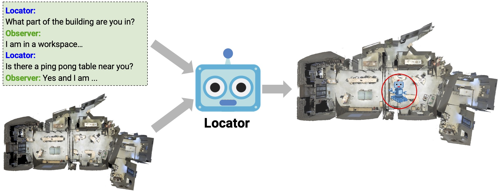

# Graph Based - LED (Localization from Embodied Dialog)

This is the offical repository for the panoramic graph based version of the LED task described in [Where Are You? Localizaiton from Embodied Dialog]
https://arxiv.org/abs/2011.08277
[[project website](https://meerahahn.github.io/way/data)]

This repository contains the implemenation of 4 models for the Localization from Embodied Dialog (LED) task on the Matterport3D Navigation Graph. 
* LingUNet model with residual connections. (from the original paper -- https://arxiv.org/abs/2011.08277)
* Random Baseline.
* Simple Crossmodal (dialog and viewpoints) Encoding.
* Attention Based Crossmodal (dialog and viewpoints) Encoding.

# Where Are You? (WAY) Dataset

The Where Are You? (WAY) dataset contains ~6k dialogs in which two humans -- an Observer and a Locator -- complete a cooperative localization task. The Observer is spawned at random in a 3D environment and can navigate from first-person views while answering questions from the Locator. The Locator must localize the Observer in a map by asking questions and giving instructions. Based on this dataset, we define three challenging tasks: Localization from Embodied Dialog or LED (localizing the Observer from dialog history), Embodied Visual Dialog (modeling the Observer), and Cooperative Localization (modeling both agents).

<p align="center">
  
</p>

## Setup

This project is developed with Python 3.6 and PyTorch 1.7

To install and setup this repo please follow [INSTALL.md](INSTALL.md)

## Usage

To run the lingunet model please see:
Please see [lingunet/README.md](src/lingunet/README.md)

To run the crossmodal models please see:
Please see [cross_modal/README.md](src/cross_modal/README.md)

## Scores
* Graph LED uses the geodesic distance on the navigation graph to determine success of a model. Note the orignal paper showed euclidean distance per floor, using the Nav Graph we can produce a prediction over all floors, which increases the difficulty of the task. 
* The lingUNet implementation in this code base provides a way to snap pixel prediction to a node in the scene graph.
*  We evaluate accuracy at 0m, 3m, 5m, 10m and geodesic localization error.
* Format to submit results to the evaluation server is a json dictionary:
`<episode_id> : {"viewpoint": <predicted_viewpointid>`

Results from provided model with geodesic distance and snap to scene graph (nodes of all floors):

  #### Val-Seen 

|Model |LE|0m|3m|5m|10m|
|------|--|--|--|--|---|
| Random Node*         | 0.0 | 0.0 | 0.0 | 0.0 | 0.0
| LingUNet-Skip        | 0.0 | 0.0 | 0.0 | 0.0 | 0.0
| Simple Crossmodal    | 0.0 | 0.0 | 0.0 | 0.0 | 0.0
| Crossmodal w/ att    | 0.0 | 0.0 | 0.0 | 0.0 | 0.0

  #### Val-Unseen 

|Model |LE|0m|3m|5m|10m|
|------|--|--|--|--|---|
| Random Node*         | 0.0 | 0.0 | 0.0 | 0.0 | 0.0
| LingUNet-Skip        | 0.0 | 0.0 | 0.0 | 0.0 | 0.0
| Simple Crossmodal    | 0.0 | 0.0 | 0.0 | 0.0 | 0.0
| Crossmodal w/ att    | 0.0 | 0.0 | 0.0 | 0.0 | 0.0


## Contributing

If you find something wrong or have a question, feel free to open an issue. If you would like to contribute, please install pre-commit before making commits in a pull request:

```bash
python -m pip install pre-commit
pre-commit install
```

## Citing

If you use the WAY dataset in your research, please cite the following [paper](https://arxiv.org/abs/2011.08277):

```
@inproceedings{hahn2020you,
  title={Where Are You? Localization from Embodied Dialog},
  author={Hahn, Meera and Krantz, Jacob and Batra, Dhruv and Parikh, Devi and Rehg, James and Lee, Stefan and Anderson, Peter},
  booktitle={Proceedings of the 2020 Conference on Empirical Methods in Natural Language Processing (EMNLP)},
  pages={806--822},
  year={2020}
}
